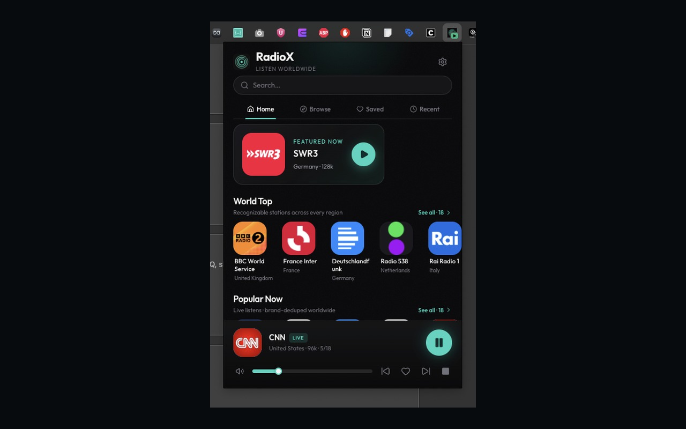
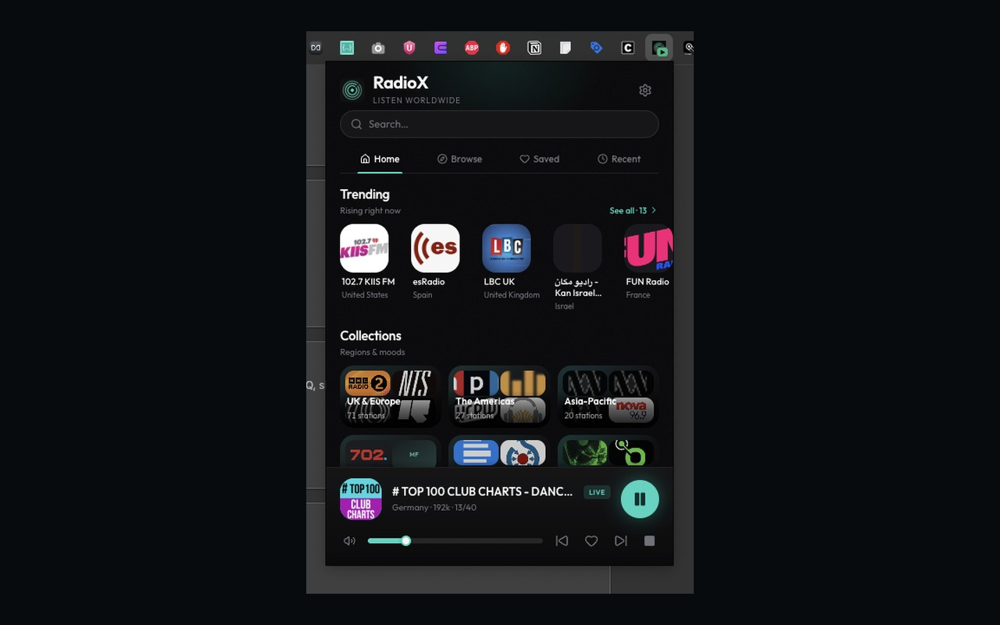
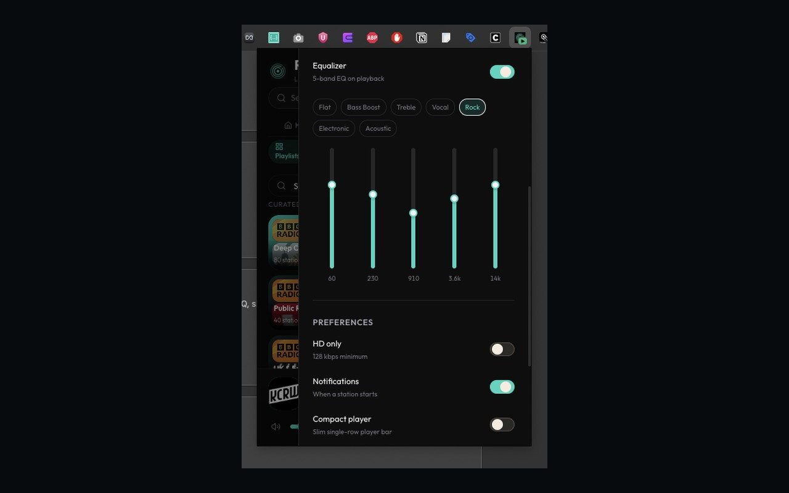
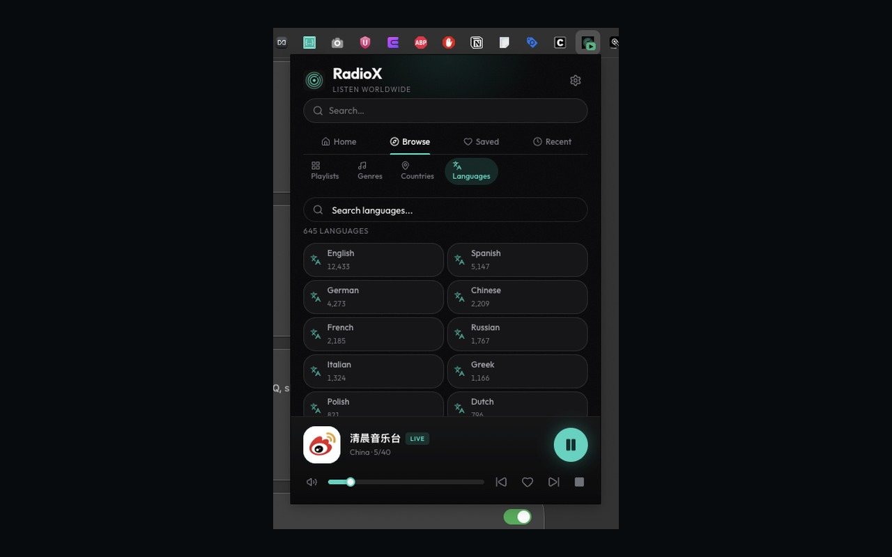
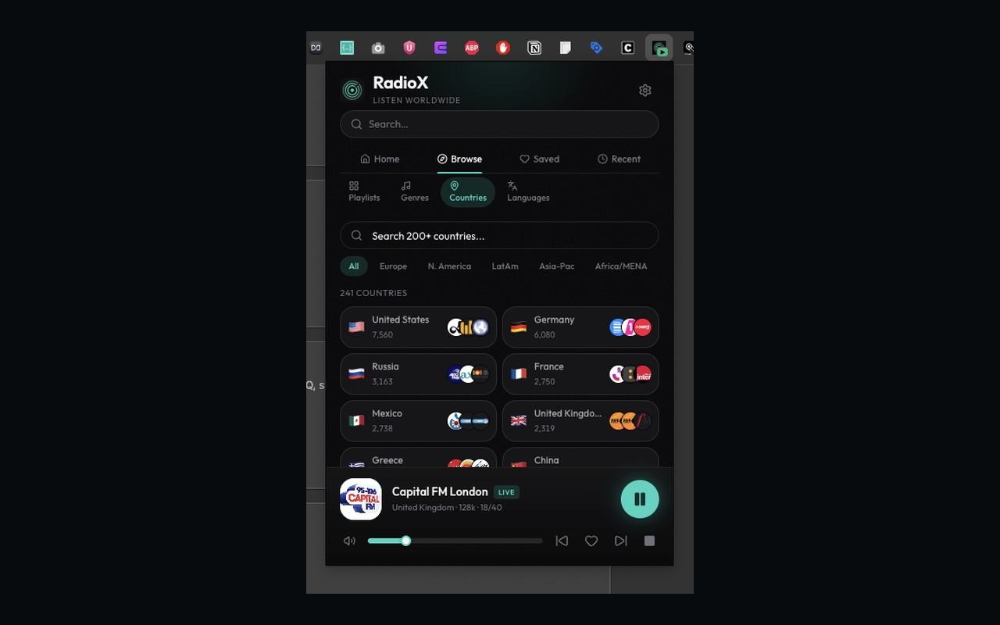

# RadioX

Premium worldwide internet radio for Chromium — curated shelves, live charts, EQ, sleep timer, and a now-playing track log. Ad-free.

**Publisher:** [Codebyte Labs](https://github.com/codebytelabs)  
**Chrome Web Store:** [RadioX - Global Internet Radio](https://chromewebstore.google.com/detail/radiox-global-internet-radio/hjdegkfegpcmoaneeoccncofofjegmpn) *(pending review)*  
**Landing:** [radiox-chrome.vercel.app](https://radiox-chrome.vercel.app)

<p align="center">
  
  
  
</p>

<p align="center">
  
  
</p>

## Features

- **40,000+ stations** via [Radio Browser](https://www.radio-browser.info/), plus curated packs (CC0)
- **Discover shelves** — Deep Cuts, World Icons, public radio, news, jazz, electronic, regions
- **Browse** by genre, country, and language
- **Background playback** — Manifest V3 offscreen audio while you browse
- **Favorites & recents** — including a now-playing **track log** with Find Song
- **EQ + sleep timer** + media keys
- **Tips optional** — Buy Me a Coffee / Ko-fi unlock unlimited track history + CSV export

## Screenshots

| Home | Languages | Equalizer |
|------|-----------|-----------|
|  |  |  |

| Trending | Countries |
|----------|-----------|
|  |  |

Store listing copy and promo tiles: [`store-assets/`](store-assets/).

## Install (developer)

```bash
npm install
npm run build
```

1. Open `chrome://extensions`
2. Enable **Developer mode**
3. **Load unpacked** → select the `dist/` folder

## Chrome Web Store

- Item ID: `hjdegkfegpcmoaneeoccncofofjegmpn`
- Listing notes: [`store-assets/LISTING.md`](store-assets/LISTING.md)

## Stack

- React 19 + TypeScript + Vite
- Tailwind CSS + shadcn/ui
- Chrome Extensions **Manifest V3** (service worker + offscreen document)

## Project layout

```
├── manifest.json
├── background.js          # Service worker
├── offscreen.js           # Audio + ICY metadata
├── src/                   # Popup UI
├── scripts/               # Catalog importers
├── store-assets/          # CWS screenshots & listing
├── store-site/            # Landing + privacy pages
└── docs/screenshots/      # README screenshots
```

## Privacy

- No analytics / no personal data collection
- Favorites, settings, and track log stay in `chrome.storage.local`
- Streams come directly from broadcasters you choose to play

See [store-site/privacy.html](store-site/privacy.html).

## Support

- [Buy Me a Coffee](https://buymeacoffee.com/codebytelabs)
- [Ko-fi](https://ko-fi.com/codebytelabs)

Supporter unlock code (honor system): `RADIOX-SUPPORTER` → Settings → Support → Unlock.

## Credits

- [Radio Browser](https://www.radio-browser.info/)
- [recommended-radio-streams](https://github.com/deroverda/recommended-radio-streams) (CC0)
- [shadcn/ui](https://ui.shadcn.com/) · [Lucide](https://lucide.dev/)

## License

[MIT](LICENSE) © Codebyte Labs
